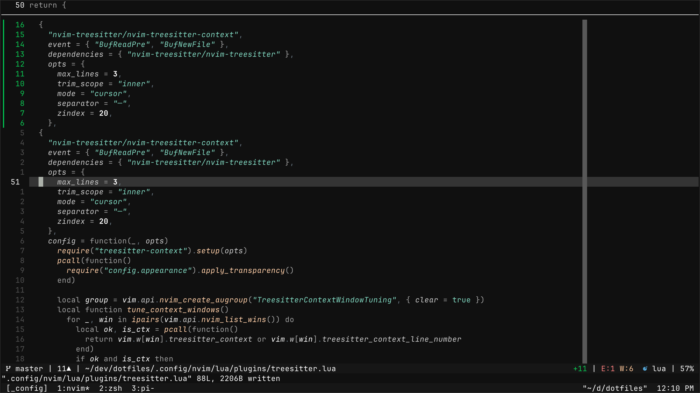

# nvim

## plugins

- **colors**
  - `datsfilipe/vesper.nvim`
- **editing**
  - `kylechui/nvim-surround`
  - `numToStr/Comment.nvim`
  - `folke/ts-comments.nvim`
  - `windwp/nvim-autopairs`
  - `mg979/vim-visual-multi`
- **search/nav**
  - `nvim-telescope/telescope.nvim`
  - `nvim-telescope/telescope-fzf-native.nvim`
  - `ThePrimeagen/harpoon`
  - `prichrd/netrw.nvim`
  - `stevearc/aerial.nvim`
- **lsp/completion**
  - `williamboman/mason.nvim`
  - `williamboman/mason-lspconfig.nvim`
  - `neovim/nvim-lspconfig`
  - `hrsh7th/nvim-cmp`
  - `L3MON4D3/LuaSnip`
  - `hrsh7th/cmp-*`
  - `saadparwaiz1/cmp_luasnip`
  - `rafamadriz/friendly-snippets`
  - `zbirenbaum/copilot.lua`
- **git**
  - `lewis6991/gitsigns.nvim`
  - `NeogitOrg/neogit`
  - `sindrets/diffview.nvim`
  - `isakbm/gitgraph.nvim`
  - `pwntester/octo.nvim`
- **syntax/format**
  - `nvim-treesitter/nvim-treesitter`
  - `nvim-treesitter/nvim-treesitter-context`
  - `stevearc/conform.nvim`
- **ui/tools**
  - `nvim-lualine/lualine.nvim`
  - `Isrothy/neominimap.nvim`
  - `akinsho/toggleterm.nvim`
  - `folke/trouble.nvim`
  - `mbbill/undotree`
  - `MeanderingProgrammer/render-markdown.nvim`
  - `folke/todo-comments.nvim`
  - `folke/persistence.nvim`
  - `kawre/leetcode.nvim`
