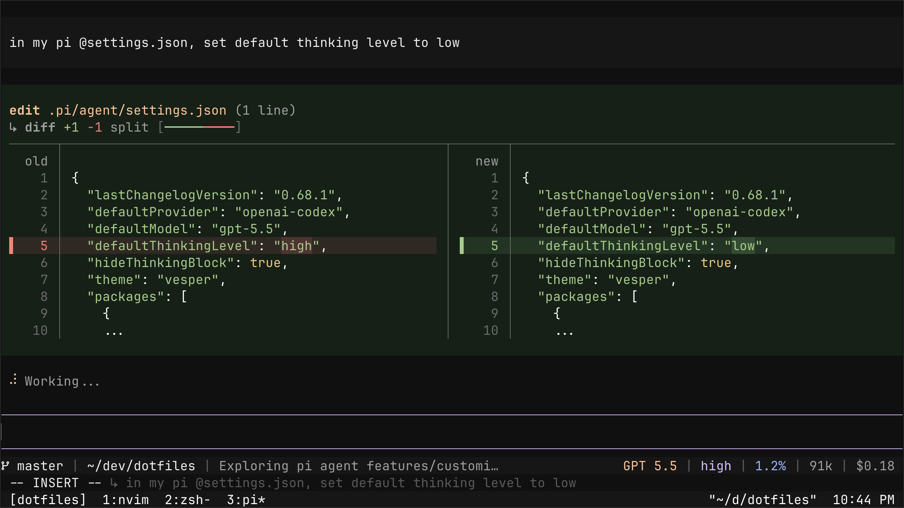

# pi

pi config lives here at `.pi/agent/` and is rsynced to `~/.pi/agent/` by `scripts/bootstrap-macos.sh`.

## Extensions

- `npm:pi-web-access`
- `npm:pi-annotate`
- `npm:@tintinweb/pi-subagents`
- `git:github.com/leohenon/pi-claude-agent-sdk`
- `npm:pi-fff`
- `git:github.com/v2nic/pi-caveman`
- `npm:@leohenon/pi-vim`
- `npm:pi-anthropic-oauth`
- `git:github.com/offline-ant/pi-tmux`
- `npm:pi-mux`
- `npm:@tryinget/pi-little-helpers`
- `git:github.com/badlogic/pi-telegram`
- `npm:pi-whisper`
- `npm:pi-snake`
- `npm:pi-session-summary`
- `git:github.com/leohenon/pi-tool-display`
- `npm:pi-skill-palette`
- `git:github.com/leohenon/my-pi-statusline`

## Skills

- `npm:pi-web-access`
- `git:github.com/v2nic/pi-caveman`
- `git:github.com/forrestchang/andrej-karpathy-skills`
- `git:github.com/leohenon/personal-conventions`

## Theme

- `themes/vesper.json`
