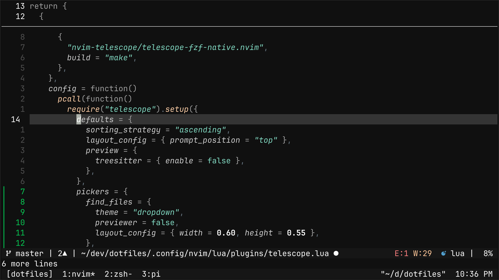
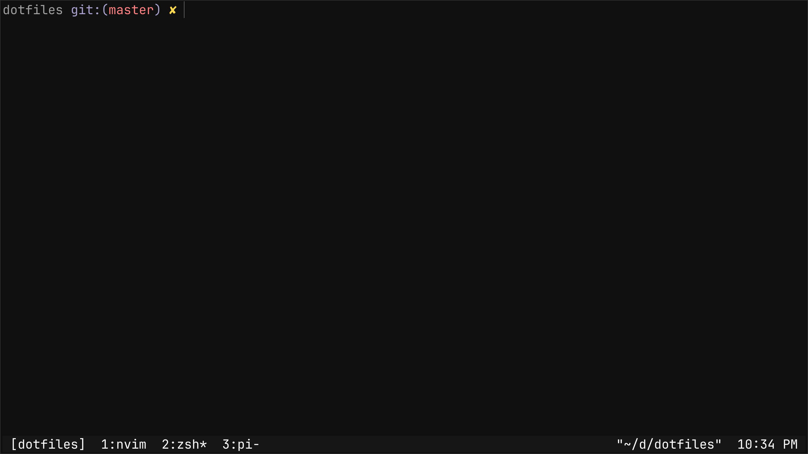
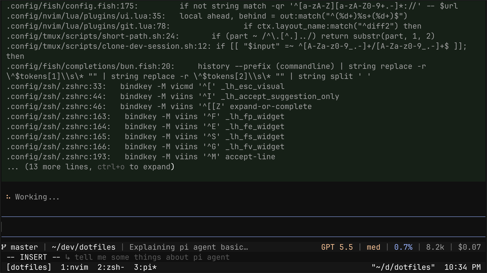

# dotfiles

macOS (Homebrew) personal dotfiles backup.

| component | link                                                           |
| --------- | -------------------------------------------------------------- |
| karabiner | [./.config/karabiner/README.md](./.config/karabiner/README.md) |
| raycast   | [./.config/raycast/README.md](./.config/raycast/README.md)     |
| ghostty   | [./.config/ghostty/README.md](./.config/ghostty/README.md)     |
| tmux      | [./.config/tmux/README.md](./.config/tmux/README.md)           |
| fish      | [./.config/fish/README.md](./.config/fish/README.md)           |
| zsh       | [./.config/zsh/README.md](./.config/zsh/README.md)             |
| shell     | [./.config/shell/README.md](./.config/shell/README.md)         |
| nvim      | [./.config/nvim/README.md](./.config/nvim/README.md)           |
| delta     | [./.config/delta/README.md](./.config/delta/README.md)         |
| pi        | [./.pi/README.md](./.pi/README.md)                             |
| brew      | [./Brewfile](./Brewfile)                                       |

Restore: [`./scripts/bootstrap-macos.sh`](./scripts/bootstrap-macos.sh)

---

